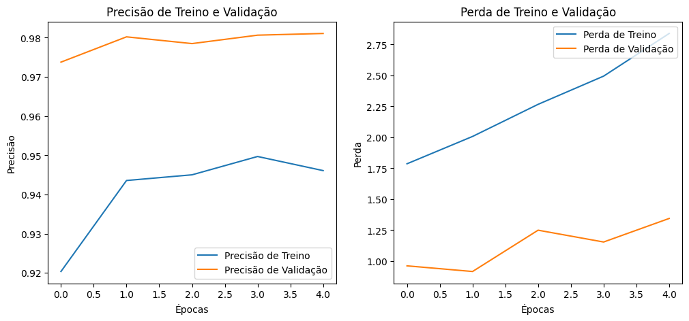

# Projeto de Transfer Learning: Classificador de Cães e Gatos

Este repositório contém o código e os recursos for um projeto de *Transfer Learning* que utiliza a rede neural pré-treinada VGG16 para criar um classificador de imagens de alta precisão, capaz de diferenciar entre cães e gatos.

## Visão Geral do Projeto

Em vez de construir e treinar uma rede neural do zero, o que exigiria um grande volume de dados e tempo de processamento, este projeto utiliza a abordagem de *Transfer Learning*. Aproveitamos o conhecimento de um modelo especialista, a VGG16, "congelando" suas camadas de convolução e treinando apenas uma nova camada de classificação para a nossa tarefa específica. Este método é extremamente eficiente e permite obter resultados de ponta com um esforço consideravelmente menor.

## Tecnologias e Bibliotecas Utilizadas

* **Python 3**
* **TensorFlow e TensorFlow Datasets**: Para carregar e pré-processar o conjunto de dados.
* **Keras**: Para construir e treinar o modelo de deep learning.
* **Matplotlib**: Para visualizar os resultados do treinamento.
* **VGG16**: Modelo pré-treinado utilizado como base para a extração de características.

## Estrutura do Projeto

O projeto é desenvolvido em um único notebook Jupyter (`dio_projeto_de_transfer_learning_em_python_.ipynb`), que abrange todas as etapas do processo, desde o carregamento dos dados até a avaliação do modelo final.

### Etapas do Projeto

1.  **Carregamento do Dataset**: O conjunto de dados "cats\_vs\_dogs" é carregado utilizando o TensorFlow Datasets e dividido em conjuntos de treinamento (80%), validação (10%) e teste (10%).

2.  **Pré-processamento e *Data Augmentation***:
    * As imagens são redimensionadas para o formato de entrada da VGG16 (224x224 pixels).
    * Técnicas de *data augmentation* (inversão horizontal, rotação e zoom aleatórios) são aplicadas ao conjunto de treinamento para aumentar a robustez do modelo e evitar o *overfitting*.

3.  **Construção do Modelo**:
    * A base convolucional da VGG16, pré-treinada no conjunto de dados ImageNet, é carregada, e suas camadas são "congeladas" para que seus pesos não sejam atualizados durante o treinamento.
    * Novas camadas são adicionadas ao topo da base VGG16:
        * `Flatten`: Para transformar a saída da base em um vetor.
        * `Dropout`: Para regularização e combate ao *overfitting*.
        * `Dense` (com ativação sigmoide): A camada de saída para a classificação binária.

4.  **Treinamento do Modelo**:
    * O modelo é compilado com o otimizador `adam` e a função de perda `binary_crossentropy`.
    * A técnica de *Early Stopping* é utilizada para monitorar a perda no conjunto de validação e interromper o treinamento quando o modelo atinge seu desempenho ótimo, evitando o *overfitting*.

5.  **Avaliação e Visualização**:
    * O desempenho final do modelo é avaliado no conjunto de teste.
    * Gráficos da precisão e da perda ao longo das épocas de treinamento são gerados para analisar o comportamento do modelo.

## Resultados

O modelo treinado alcançou uma **precisão de 98.45%** no conjunto de teste, demonstrando a eficácia da abordagem de *Transfer Learning* para problemas de classificação de imagens.

## Como Executar o Projeto

A maneira mais fácil de executar este projeto é através do Google Colab, que não requer nenhuma instalação de software em sua máquina local.

1.  **Abra o notebook no Google Colab:**
    * Clique no link a seguir para acessar o notebook: [dio\_projeto\_de\_transfer\_learning\_em\_python .ipynb](https://colab.research.google.com/drive/1JuixrjKhB-1whci-enGLtJeuELiVQdeL?usp=sharing)

2.  **Execute as células:**
    * No ambiente do Colab, você pode executar cada célula de código sequencialmente para ver o processo de construção e treinamento do modelo em ação.

Para quem preferir executar localmente, siga os passos abaixo:

1.  **Clone o repositório:**
    ```bash
    git clone https://github.com/ede1000son/dio-projeto-de-transfer-learning-em-python.git
    ```
2.  **Instale as dependências:**
    ```bash
    pip install tensorflow tensorflow-datasets matplotlib
    ```
3.  **Execute o notebook Jupyter:**
    Abra e execute o arquivo `dio_projeto_de_transfer_learning_em_python_.ipynb` em um ambiente Jupyter.

## Gráficos de Treinamento

Os gráficos abaixo ilustram a evolução da precisão e da perda durante o treinamento nos conjuntos de treinamento e validação.



*Observação: A imagem acima é um exemplo. Para visualizar os gráficos reais, execute o notebook.*